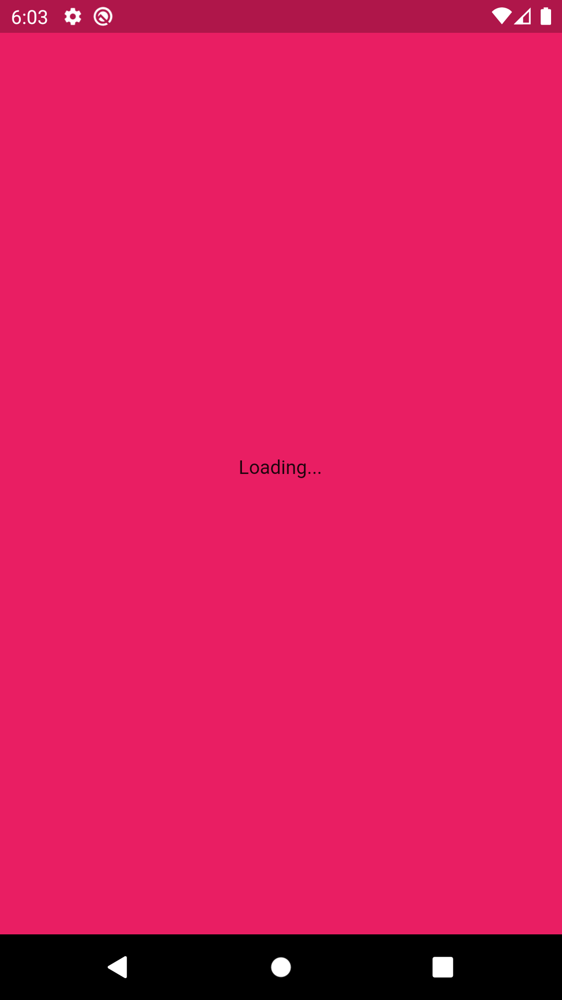
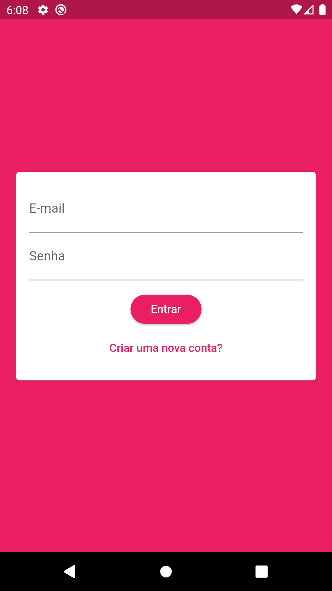
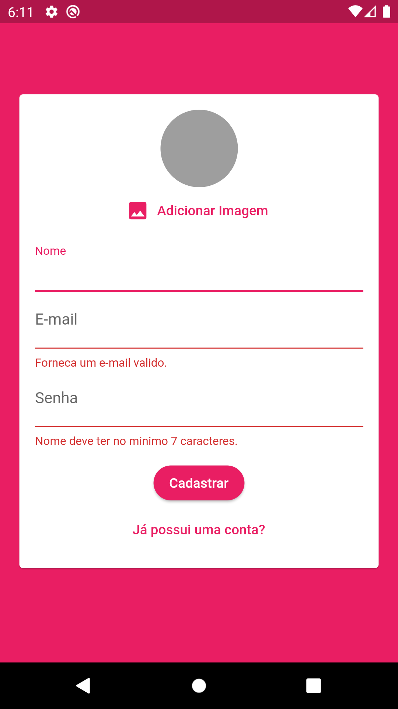
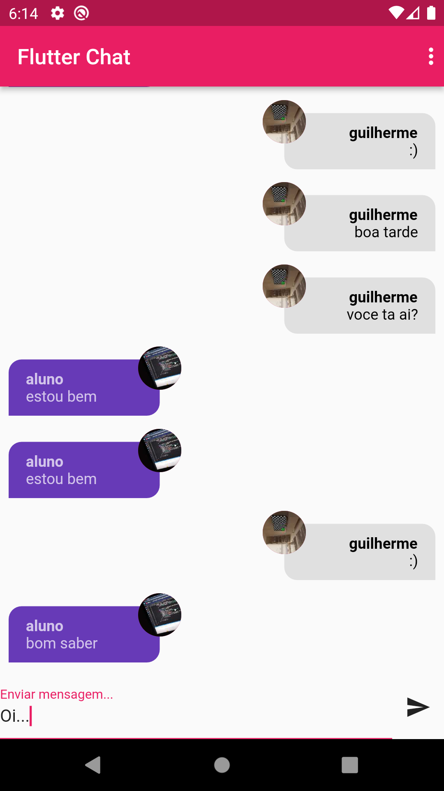

# chat

A new Flutter project.

Projeto feito no curso da udemy, app um chat que usuário tem que cadastra para entra no chat, e o dados do cadastro estão no firebase cloud

# app_chat_flutter

<!-- 
Carregamendo do appp   
  -->

<table style="border: 10px solid black">
  <tr>
    <td>Carregamendo do appp</td>
    <td></td>
    <td>Login da app</td>
    <td></td>
  </tr>
  <tr>
    <td>Cadastro do app</td>
    <td></td>
    <td>chat --></td>
    <td></td>
  </tr>
</table> 

